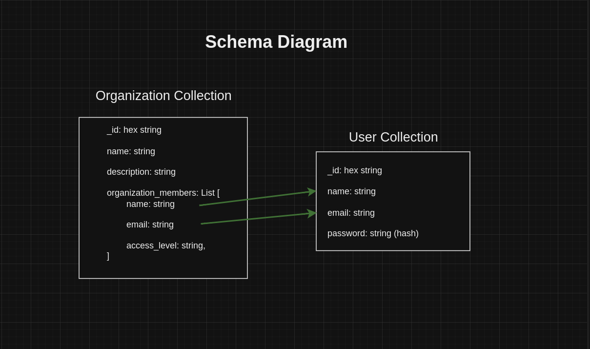

# API for Organization managment with JWT Auth

## Tech Stack
- Flask
- MongoDB
- Redis

## features
- Sign Up
- Sign In
- Refresh access token using Refresh token
- Revoke Refresh token
- Create Organization
- Update Organization
- Delete Organization
- View Organization/s
- Invite user to organization
## MongoDB Schema
